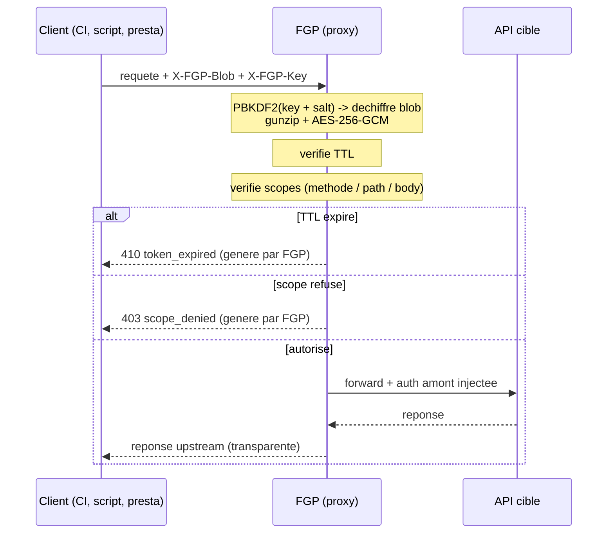

# Fine-Grained Proxy

### Des tokens a granularite fine, stateless et chiffres, devant n'importe quelle API

<div class="pt-8 opacity-70 text-sm">
  Zero storage &middot; double cle &middot; scoping methode / path / body &middot; TTL
</div>

<div class="abs-br m-6 text-xs opacity-50">
  <carbon:logo-github /> lsagetlethias/fine-grained-proxy
</div>

<!--
Tour de table express. Public mixte dev/secu. Le fil rouge : comment donner un acces API restreint et temporaire sans backend, sans base de donnees, sans faire confiance a l'URL.
-->

---
transition: fade-out
---

# Le probleme

Certaines APIs n'ont **que deux niveaux d'acces** : le token complet, ou rien
(comme Scalingo).

<v-clicks>

- Un token API, c'est souvent **tout ou rien** : full read/write sur tout le
  compte.
- Donner a un script CI le droit de **deployer une seule app** implique de
  confier un token qui peut **tout faire**.
- Laisser un prestataire **lire une ressource pendant 24h** : le token fourni ne
  sait pas expirer.
- Les scopes natifs, quand ils existent, sont **grossiers** (`read`, `write`) et
  **jamais** au niveau du contenu de la requete.

</v-clicks>

<v-click>

<div class="mt-6 p-4 border border-red-500/40 rounded bg-red-500/5">
  Resultat : on copie-colle des tokens surpuissants dans des CI, des webhooks, des tickets. Le blast radius d'une fuite est maximal.
</div>

</v-click>

<!--
Insister sur le cas concret : un deploy hook CI qui a besoin de POST sur un endpoint precis se retrouve avec un token capable de supprimer toutes les apps. Le public secu connait bien ce probleme : sur-privilege par defaut.
-->

---

# Ce qu'on voudrait vraiment

<div class="grid grid-cols-2 gap-6 mt-6">

<div v-click class="p-4 border border-cyan-500/30 rounded">

### Granularite fine

Restreindre par **methode HTTP**, **path**, et meme **contenu du body**.

`POST:/v1/apps/my-app/scale` et rien d'autre.

</div>

<div v-click class="p-4 border border-cyan-500/30 rounded">

### Duree de vie

Un acces qui **expire tout seul**. Pas de revocation manuelle a ne pas oublier.

</div>

<div v-click class="p-4 border border-cyan-500/30 rounded">

### Zero infra

Pas de base de donnees, pas de table de tokens a gerer, a backup, a fuir.

</div>

<div v-click class="p-4 border border-cyan-500/30 rounded">

### Agnostique

Marche devant **n'importe quelle** API HTTP, sans la modifier.

</div>

</div>

<!--
C'est la wishlist. FGP coche les quatre. Le truc non-trivial c'est "zero infra" + "duree de vie" + "secret" en meme temps : sans stockage, ou vit la config ? Reponse : dans un blob chiffre.
-->

---
layout: center
class: text-center
---

# L'idee

<div class="text-2xl mt-4 leading-relaxed">
Un proxy HTTP <span class="text-cyan-400">stateless</span> qui s'intercale devant l'API cible.
</div>

<div class="text-xl mt-6 opacity-80">
Toute la config (token amont, cible, auth, scopes, TTL) est <span class="text-cyan-400">chiffree dans un blob</span>.
</div>

<div class="text-xl mt-6 opacity-80">
Le blob est <span class="text-cyan-400">inexploitable seul</span> : il faut une cle client separee pour le dechiffrer.
</div>

<div class="mt-10 text-sm opacity-60">
Pas de DB. Le serveur ne stocke rien. Le secret voyage avec la requete, mais sous deux verrous.
</div>

---

# Vue d'ensemble du flow

<div class="flex justify-center mt-2 mb-8">



</div>

<div class="text-xs opacity-60 text-center">
Le serveur FGP ne connait que son <code>FGP_SALT</code>. Sans la cle client, il ne peut rien dechiffrer non plus.
</div>

<!--
Point cle pour le public secu : meme un FGP compromis au repos ne donne rien, car la cle client ne transite qu'au moment de la requete et n'est jamais stockee. Le serveur voit le secret en clair seulement le temps de traiter la requete (memoire).
-->

---

# Le blob : qu'est-ce qu'il y a dedans

<div class="grid grid-cols-2 gap-6">

<div>

```ts
interface BlobConfig {
  v: number;          // version (2 ou 3)
  token: string;      // secret amont vers l'API
  target: string;     // https://api.cible.com
  auth: string;       // bearer | basic | ...
  scopes: Scope[];    // METHOD:PATH (+ body)
  ttl: number;        // secondes, 0 = jamais
  createdAt: number;  // timestamp d'emission
  name?: string;      // libelle de config (optionnel)
  logs?: { ... }      // opt-in stream (ADR-7)
}
```

</div>

<div class="text-sm pt-4">

<v-clicks>

- Le `token` amont est **dans** le blob : c'est lui qu'on protege.
- `scopes` definit **exactement** ce que ce blob a le droit de faire.
- `ttl` + `createdAt` => expiration verifiee a chaque requete.
- Tout ca est serialise JSON, **gzippe**, puis **chiffre**.

</v-clicks>

</div>

</div>

<!--
Le blob est auto-suffisant : il porte sa propre cible, son propre secret amont, ses propres regles. C'est ce qui rend le serveur stateless. La contrepartie : si on change les regles, on regenere un blob, on ne "patch" pas un existant.
-->

---

# La double cle : pourquoi le blob seul ne vaut rien

<div class="grid grid-cols-3 gap-4 mt-6 text-center">

<div v-click class="p-4 border border-purple-500/30 rounded">
<div class="text-3xl mb-2"><carbon:document-blank /></div>
<div class="font-bold">Blob</div>
<div class="text-xs opacity-70 mt-2">Voyage dans l'URL ou le header <code>X-FGP-Blob</code>. Visible, loggable, partageable.</div>
</div>

<div v-click class="p-4 border border-purple-500/30 rounded">
<div class="text-3xl mb-2"><carbon:password /></div>
<div class="font-bold">Cle client</div>
<div class="text-xs opacity-70 mt-2">Header <code>X-FGP-Key</code>. Connue du seul detenteur. Jamais stockee serveur.</div>
</div>

<div v-click class="p-4 border border-purple-500/30 rounded">
<div class="text-3xl mb-2"><carbon:enterprise /></div>
<div class="font-bold">Salt serveur</div>
<div class="text-xs opacity-70 mt-2"><code>FGP_SALT</code>, secret d'instance. Jamais expose.</div>
</div>

</div>

<v-click>

<div class="mt-8 text-center text-lg">
Dechiffrement possible <span class="text-cyan-400">seulement</span> avec les <span class="text-cyan-400">trois</span> reunis.
</div>

<div class="mt-3 text-center text-sm opacity-70">
Blob qui fuite dans un log ? Inutile sans la cle. Cle qui fuite ? Inutile sans le blob ET le salt.
</div>

</v-click>

<!--
C'est l'argument de defense en profondeur. Trois facteurs, trois lieux differents : URL/header (blob), detenteur (cle), instance serveur (salt). Compromettre un seul ne suffit pas. On montrera en demo qu'un decode sans la bonne cle echoue net.
-->

---

# Le pipeline crypto, en bref

<div class="grid grid-cols-2 gap-8 mt-4">

<div>

### Chiffrement (a la generation)

<v-clicks>

1. `JSON.stringify(config)`
2. **gzip** (compression)
3. cle = **PBKDF2**(cle client + salt) : 100k iters, SHA-256
4. **AES-256-GCM** + IV aleatoire (12 bytes)
5. `base64url(IV + ciphertext)` => le **blob**

</v-clicks>

</div>

<div>

### Dechiffrement (a chaque requete)

<v-clicks>

1. `base64url` decode, separer IV / ciphertext
2. re-deriver la **meme cle** (cle client + salt)
3. **AES-GCM decrypt** : mauvaise cle => echec net
4. **gunzip** + `JSON.parse` + validation de la shape
5. la config repart vers les checks TTL + scopes

</v-clicks>

</div>

</div>

<v-click>

<div class="mt-6 p-3 border border-cyan-500/30 rounded bg-cyan-500/5 text-sm">
Web Crypto natif, <b>zero lib crypto tierce</b>. <b>AES-GCM</b> = chiffrement authentifie : toute alteration du blob fait echouer le dechiffrement (anti-tamper, pas de MAC separe). <b>PBKDF2 100k iterations</b> rend le brute-force de la cle couteux. Operation symetrique : meme derivation a la generation et a chaque requete.
</div>

</v-click>

<!--
Rester haut niveau, pas de deroule de code : c'est du Web Crypto standard. Le message pour un public secu tient en deux proprietes : GCM authentifie (anti-tamper) et PBKDF2 fort (anti-brute-force). Insister que c'est symetrique gen/runtime et qu'aucune lib crypto tierce n'est a auditer.
-->

---

# Scoping niveau 1 : methode + path

Un scope, c'est `METHOD:PATH` avec wildcards.

```ts
scopes: [
  "GET:/v1/apps/*", // lire toutes les apps
  "POST:/v1/apps/my-app/scale", // scaler UNE app precise
];
```

<div class="grid grid-cols-2 gap-4 mt-6 text-sm">

<div v-click class="p-3 border border-green-500/30 rounded bg-green-500/5">
<code>GET /v1/apps/my-app</code><br/>
<span class="text-green-400">autorise</span> (match <code>GET:/v1/apps/*</code>)
</div>

<div v-click class="p-3 border border-red-500/30 rounded bg-red-500/5">
<code>DELETE /v1/apps/my-app</code><br/>
<span class="text-red-400">refuse</span> (aucun scope DELETE)
</div>

<div v-click class="p-3 border border-red-500/30 rounded bg-red-500/5">
<code>POST /v1/apps/other-app/scale</code><br/>
<span class="text-red-400">refuse</span> (path ne matche pas)
</div>

<div v-click class="p-3 border border-red-500/30 rounded bg-red-500/5">
<code>GET /v1/apps</code><br/>
<span class="text-red-400">refuse</span> (le wildcard exige &ge;1 char apres <code>/apps/</code>)
</div>

</div>

<!--
Deja, rien qu'avec methode + path, on transforme un token full-access en un token "lecture apps + scale d'une seule app". Mais on peut aller plus loin : filtrer le CONTENU du body.
-->

---

# Scoping niveau 2 : body filters (blob v3)

Le killer feature : restreindre **le contenu JSON** de la requete.

<div class="text-sm mb-2 opacity-80">Use case CI/CD : "deploiement autorise, mais seulement sur <code>main</code> ou <code>master</code>".</div>

```ts {all|3|4-7}
{
  methods: ["POST"],
  pattern: "/v1/apps/my-app/deployments",
  bodyFilters: [{
    objectPath: "deployment.git_ref",          // dot-path dans le body
    objectValue: [{ type: "stringwildcard", value: "ma*" }] // OR entre valeurs
  }]
}
```

<div class="grid grid-cols-2 gap-4 mt-4 text-sm">

<div v-click class="p-3 border border-green-500/30 rounded bg-green-500/5">
body <code>{ deployment: { git_ref: "main" } }</code><br/>
<span class="text-green-400">autorise</span>
</div>

<div v-click class="p-3 border border-red-500/30 rounded bg-red-500/5">
body <code>{ deployment: { git_ref: "hotfix-x" } }</code><br/>
<span class="text-red-400">refuse</span>
</div>

</div>

<div v-click class="text-xs opacity-60 mt-3">
Types de filtres : <code>any</code>, <code>wildcard</code>, <code>stringwildcard</code>, <code>regex</code>, <code>not</code>, <code>and</code>. AND implicite entre filtres, OR entre valeurs.
</div>

<!--
C'est ce qui distingue FGP des scopes classiques. Aucun fournisseur de token ne permet de dire "POST autorise seulement si le champ git_ref vaut main". Pour un public secu, c'est le passage d'un controle d'acces base ressource a un controle base contenu.
-->

---

# Les autres briques

<div class="grid grid-cols-2 gap-6 mt-4">

<div v-click class="p-4 border border-cyan-500/30 rounded">

### TTL

`ttl` + `createdAt` dans le blob. Verifie a chaque requete, avant la logique
metier.

`ttl: 0` = pas d'expiration (a utiliser avec parcimonie).

</div>

<div v-click class="p-4 border border-cyan-500/30 rounded">

### 4 modes d'auth amont

`bearer`, `basic`, `header custom`, `scalingo-exchange`.

Le client ne voit jamais le secret amont : FGP l'injecte au forward.

</div>

<div v-click class="p-4 border border-cyan-500/30 rounded">

### Dual mode blob

Dans l'URL (`/{blob}/path`) ou en header `X-FGP-Blob` (recommande, pas de limite
255 char).

</div>

<div v-click class="p-4 border border-cyan-500/30 rounded">

### Proxy transparent

La reponse upstream est forwardee telle quelle. `X-FGP-Source: proxy|upstream`
distingue qui repond. Seul `Set-Cookie` est strippe.

</div>

</div>

<!--
Le X-FGP-Source est un detail secu sympa : le client sait toujours si une erreur vient du proxy (refus de scope) ou de l'API reelle. Pas de confusion entre un 403 FGP et un 403 upstream.
-->

---
layout: center
class: text-center
---

# Demo

<div class="text-lg opacity-80 mt-4">
On genere un blob via l'UI, puis on le malmene au terminal.
</div>

<div class="mt-8 grid grid-cols-4 gap-3 text-sm">
  <div class="p-3 border border-cyan-500/30 rounded">1. Generer<br/><span class="opacity-60 text-xs">UI web</span></div>
  <div class="p-3 border border-green-500/30 rounded">2. Requete OK<br/><span class="opacity-60 text-xs">terminal</span></div>
  <div class="p-3 border border-red-500/30 rounded">3. Scope / body / TTL refuses<br/><span class="opacity-60 text-xs">terminal</span></div>
  <div class="p-3 border border-purple-500/30 rounded">4. Blob opaque<br/><span class="opacity-60 text-xs">decode KO</span></div>
</div>

<div class="abs-br m-6 text-xs opacity-50">commands prets dans <code>demo.sh</code></div>

<!--
Basculer sur l'UI (localhost:8000) et un terminal cote a cote. Garder ce slide comme checklist. Le demo.sh contient les 4 etapes en copier-coller.
-->

---

# Demo 1 - generer (UI)

<div class="grid grid-cols-2 gap-6">

<div>

A la racine `http://localhost:8000/` :

<v-clicks>

- on saisit le **token amont** + la **cible**
- on choisit le **mode d'auth**
- on coche / tape les **scopes** (+ body filters)
- on fixe un **TTL** court pour la demo
- "Generer" => on recupere **URL + blob + cle**

</v-clicks>

</div>

<div>

Equivalent curl (ce que fait l'UI) :

```bash
curl -X POST localhost:8000/api/generate \
  -H "Content-Type: application/json" \
  -d '{
    "token": "demo-secret-1234",
    "target": "http://localhost:9000",
    "auth": "bearer",
    "scopes": [
      "GET:/v1/apps", "GET:/v1/apps/*",
      { "methods": ["POST"],
        "pattern": "/v1/apps/my-app/deployments",
        "bodyFilters": [{ "objectPath": "deployment.git_ref",
          "objectValue": [{ "type": "stringwildcard",
                            "value": "ma*" }] }] }
    ],
    "ttl": 120
  }'
```

```json
{ "url": "...", "key": "a7f2...", "blob": "eyJ..." }
```

</div>

</div>

<!--
Montrer l'UI en vrai : la generation du blob, le bouton copier, le partage de config (?c=) qui n'inclut jamais le token. Insister : la cle client est affichee une fois, c'est au detenteur de la garder. La demo pointe sur un mock local (zero dependance reseau) ; en vrai la cible est l'API reelle (Scalingo, etc.) avec le mode d'auth adapte.
-->

---

# Demo 2 - requete autorisee (terminal)

Mode header, le blob ne pollue pas l'URL :

```bash {all|2|3|all}
curl localhost:8000/v1/apps \
  -H "X-FGP-Key:  a7f2c9d4-1234-..." \
  -H "X-FGP-Blob: eyJhbGci..."
```

<v-click>

Reponse : le **JSON de l'API cible**, tel quel, avec `X-FGP-Source: upstream`.

```bash
< HTTP/1.1 200 OK
< x-fgp-source: upstream
[ { "id": "...", "name": "my-app" }, ... ]
```

</v-click>

<v-click>

<div class="mt-4 text-sm opacity-70">
FGP a : dechiffre le blob, valide le TTL, matche <code>GET /v1/apps</code> contre le scope exact <code>GET:/v1/apps</code>, injecte l'auth amont (bearer ici), forwarde. Le client n'a jamais vu le token amont.
</div>

</v-click>

<!--
Le moment "waouh" discret : la reponse est celle de la vraie API, mais le client n'a aucun secret amont. Montrer le header x-fgp-source: upstream pour prouver que ca vient bien de la cible.
-->

---

# Demo 3 - les refus (terminal)

<div class="grid grid-cols-3 gap-3 text-xs">

<div>

**Scope refuse**

```bash
curl -X DELETE \
  localhost:8000/v1/apps/my-app \
  -H "X-FGP-Key: ..." \
  -H "X-FGP-Blob: ..."
```

```json
< HTTP/1.1 403 Forbidden
< x-fgp-source: proxy
{ "error": "scope_denied" }
```

</div>

<div>

**Body filter refuse**

```bash
curl -X POST \
  localhost:8000/v1/apps/my-app/deployments \
  -H "X-FGP-Key: ..." \
  -H "X-FGP-Blob: ..." \
  -d '{"deployment":{"git_ref":"hotfix"}}'
```

```json
< HTTP/1.1 403 Forbidden
< x-fgp-source: proxy
{ "error": "scope_denied" }
```

</div>

<div>

**TTL expire**

```bash
# apres 120s
curl localhost:8000/v1/apps \
  -H "X-FGP-Key: ..." \
  -H "X-FGP-Blob: ..."
```

```json
< HTTP/1.1 410 Gone
< x-fgp-source: proxy
{ "error": "token_expired" }
```

</div>

</div>

<v-click>

<div class="mt-6 text-center text-sm">
Dans les trois cas : <span class="text-red-400">rien n'a ete forwarde</span> vers l'API cible. <code>X-FGP-Source: proxy</code> le prouve.
</div>

</v-click>

<!--
C'est le coeur de la valeur secu : le blast radius est borne par le blob. Meme avec le blob ET la cle en main, l'attaquant ne peut faire QUE ce que les scopes autorisent, et seulement jusqu'a expiration.
-->

---

# Demo 4 - le blob est opaque

Sans la **bonne** cle client, le blob ne donne rien.

```bash {all|1-4|6-9}
# Bonne cle : decode OK (token redacte dans la reponse)
curl -X POST localhost:8000/api/decode \
  -H "Content-Type: application/json" \
  -d '{"blob":"eyJ...","key":"a7f2c9d4-..."}'

# Mauvaise cle : GCM echoue, aucune fuite
curl -X POST localhost:8000/api/decode \
  -H "Content-Type: application/json" \
  -d '{"blob":"eyJ...","key":"WRONG-KEY"}'
```

<v-click>

```json
// mauvaise cle -> 401 Unauthorized
{ "error": "invalid_credentials", "message": "Unable to decrypt blob" }
```

</v-click>

<v-click>

<div class="mt-6 p-4 border border-purple-500/30 rounded bg-purple-500/5 text-sm">
Le blob peut trainer dans un historique shell, un log d'access, un ticket Jira. <span class="text-purple-300">Sans la cle client ET le salt serveur, il reste du bruit chiffre.</span> AES-256-GCM, IV unique par blob, cle derivee en PBKDF2 100k iterations.
</div>

</v-click>

<!--
Demo defensive : on prouve que la separation blob/cle tient. Bonus : meme l'API /api/decode redacte le token dans sa reponse, donc l'UI d'inspection ne reaffiche jamais le secret amont en clair.
-->

---

# Surface d'attaque, honnetement

<div class="grid grid-cols-2 gap-6 text-sm mt-2">

<div>

### Ce qui est couvert

<v-clicks>

- Blob qui fuite => inutile sans cle + salt
- Alteration du blob => GCM rejette
- Sur-privilege => scopes methode/path/body
- Acces perpetuel => TTL force
- Brute-force cle => PBKDF2 100k iters
- Secret amont => jamais expose au client

</v-clicks>

</div>

<div>

### Ce dont il faut etre conscient

<v-clicks>

- FGP voit le secret **en clair en memoire** au moment du proxy (inevitable pour
  un proxy)
- Mode `scalingo-exchange` : le bearer derive est **cache en clair en memoire
  jusqu'a 55 min** (perf vs rate limit), pas seulement le temps de la requete
- `FGP_SALT` compromis + cle client connue => blob dechiffrable : **proteger le
  salt** comme un secret d'instance
- Pas de revocation avant TTL (stateless) : on coupe via rotation du salt
  (nucleaire) ou TTL courts
- HTTPS **obligatoire** : la cle client transite en header
- Replay possible dans la fenetre TTL si blob+cle interceptes en clair

</v-clicks>

</div>

</div>

<!--
Ne pas survendre. Le public secu respecte l'honnetete sur le modele de menace. Le point "pas de revocation" est le vrai trade-off du stateless : on l'assume avec des TTL courts. La rotation de salt invalide TOUS les blobs d'un coup, c'est l'option nucleaire.
-->

---

# Bonus : observabilite zero-trust (`/logs`)

Stream live des requetes **par blob**, opt-in, in-memory only.

<div class="grid grid-cols-2 gap-6 text-sm mt-4">

<div>

<v-clicks>

- Opt-in via `logs: { enabled, detailed }` **dans le blob**
- SSE live sur `/logs/stream` (heartbeat, reconnect `?since=`)
- Ring buffer **en memoire**, purge a l'inactivite. Aucune persistance.
- **Jamais capture** : headers de requete (anti-fuite cookies/tokens), target
  upstream
- Kill switch global `FGP_LOGS_ENABLED`

</v-clicks>

</div>

<div>

<v-click>

<div class="p-4 border border-cyan-500/30 rounded bg-cyan-500/5">
Le mode <code>detailed</code> capture le body, mais <span class="text-cyan-300">chiffre cote serveur avec la cle client</span>. Le serveur stocke du ciphertext qu'il ne peut pas relire seul. Le dechiffrement se fait **dans le navigateur** du detenteur de la cle.
</div>

</v-click>

<v-click>

<div class="mt-3 text-xs opacity-60">
Meme la feature de debug respecte le modele double-cle. Le serveur ne devient jamais un point de fuite des bodies.
</div>

</v-click>

</div>

</div>

<!--
C'est le slide qui montre que le zero-trust est applique partout, y compris dans le tooling de debug. Un dump de la memoire FGP ne donne pas les bodies en clair : ils sont chiffres avec une cle que le serveur ne stocke pas.
-->

---

# Stack

<div class="grid grid-cols-2 gap-8 mt-4">

<div>

- **Runtime** : Deno 2.x
- **Framework** : Hono
- **Langage** : TypeScript strict, zero `any`
- **Crypto** : Web Crypto API native (AES-256-GCM, PBKDF2)
- **Tests** : `deno test` (unit / integration / e2e)
- **Deploy** : Deno Deploy (edge, stateless)

</div>

<div>

<div class="p-4 border border-green-500/30 rounded text-sm">

### Pourquoi ce sont de bons choix secu

- **Deno** : permissions explicites, pas de `node_modules` opaque
- **Web Crypto native** : pas de lib crypto tierce a auditer/CVE
- **Stateless** : pas de DB = pas de surface de fuite au repos
- **Strict TS** : la shape du blob est validee, pas de `any` qui passe

</div>

</div>

</div>

<!--
Argument supply-chain : zero dependance crypto tierce, tout est dans la plateforme. Deno coupe court au probleme node_modules. Pour un forum secu, c'est un point de confiance non-negligeable.
-->

---

# Bonus : comment c'est construit (equipe IA)

<div class="text-sm opacity-80 mb-4">
FGP <b>et ce deck</b> ont ete construits par Claude Code en <b>lead dev</b>, pilotant une equipe
multi-agent montee a la main (fiches de poste + skills + hooks), avant meme que l'orchestration
native (<code>/workflows</code>) n'existe.
</div>

<div class="grid grid-cols-2 gap-6 text-sm">

<div v-click class="p-4 border border-cyan-500/30 rounded">

### Une directive multi-agent maison

Une **fiche de poste** par role (scope fichiers + checklist) :

- **lead** : orga, review structurelle, commit
- **dev** : code (`src/`, `tests/`), self-review
- **PO** : specs + doc (`docs/`, `*.md`)
- **testeur** : AC Given/When/Then, recette
- **designer** : specs UI/UX, **pas** d'integration

</div>

<div v-click class="p-4 border border-purple-500/30 rounded">

### Les garde-fous

- Skills locaux : `/verif` (lint+fmt+check+test), `/add-tests`, `/sync-docs`
- **Hook pre-commit** qui gate le process
- Separation des roles stricte (le designer ne touche pas a `main.ts`)
- L'humain = **architecte / client** : il copilote les arbitrages, il ne code pas

</div>

</div>

<v-click>

<div class="mt-5 p-3 border border-green-500/30 rounded bg-green-500/5 text-sm">
Dogfooding : la review de <b>ce deck</b> a tourne en multi-agent (dev + PO), et a rattrape plusieurs erreurs factuelles avant diffusion.
</div>

</v-click>

<!--
Meta-slide : on dogfood l'approche multi-agent. Le point pour un public tech : c'est reproductible et versionne dans le repo (fiches de poste docs/team/, skills .claude/skills/, hook PreToolUse, docs/ia-architecture-reference.md). Et /workflows natif valide a posteriori l'intuition qu'on avait codee a la main.
-->

---
layout: center
class: text-center
---

# A retenir

<div class="grid grid-cols-3 gap-4 mt-8 text-sm">

<div class="p-4 border border-cyan-500/30 rounded">
<div class="text-2xl mb-2"><carbon:cut /></div>
<b>Fine-grained</b><br/>
<span class="opacity-70">methode + path + body</span>
</div>

<div class="p-4 border border-purple-500/30 rounded">
<div class="text-2xl mb-2"><carbon:locked /></div>
<b>Double cle + zero storage</b><br/>
<span class="opacity-70">blob inexploitable seul</span>
</div>

<div class="p-4 border border-green-500/30 rounded">
<div class="text-2xl mb-2"><carbon:time /></div>
<b>TTL + agnostique</b><br/>
<span class="opacity-70">devant n'importe quelle API</span>
</div>

</div>

<div class="mt-10 text-lg">
Un acces API <span class="text-cyan-400">restreint</span>, <span class="text-cyan-400">temporaire</span> et <span class="text-cyan-400">sans backend</span>.
</div>

<div class="mt-10 opacity-70 text-sm">
<carbon:logo-github /> github.com/lsagetlethias/fine-grained-proxy &middot; Questions ?
</div>

<!--
Resumer en une phrase : restreint, temporaire, sans backend. Ouvrir le Q&A. Avoir l'UI et un terminal sous la main pour rejouer une demo a la demande.
-->
